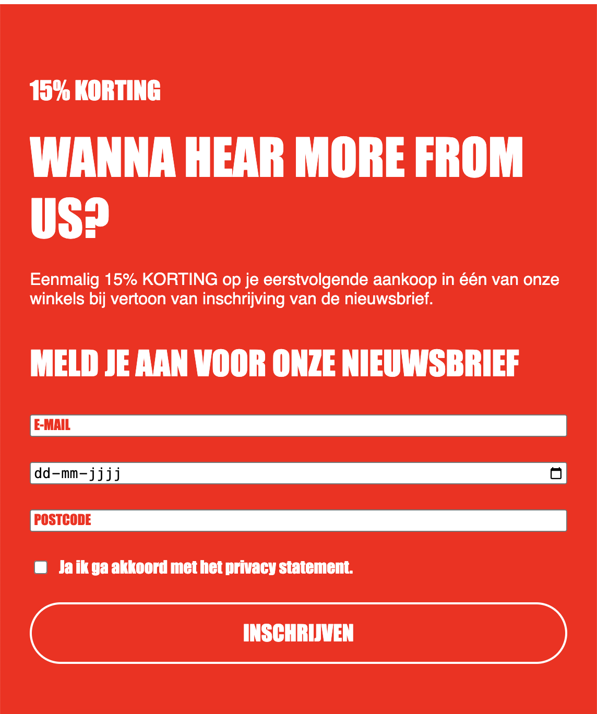
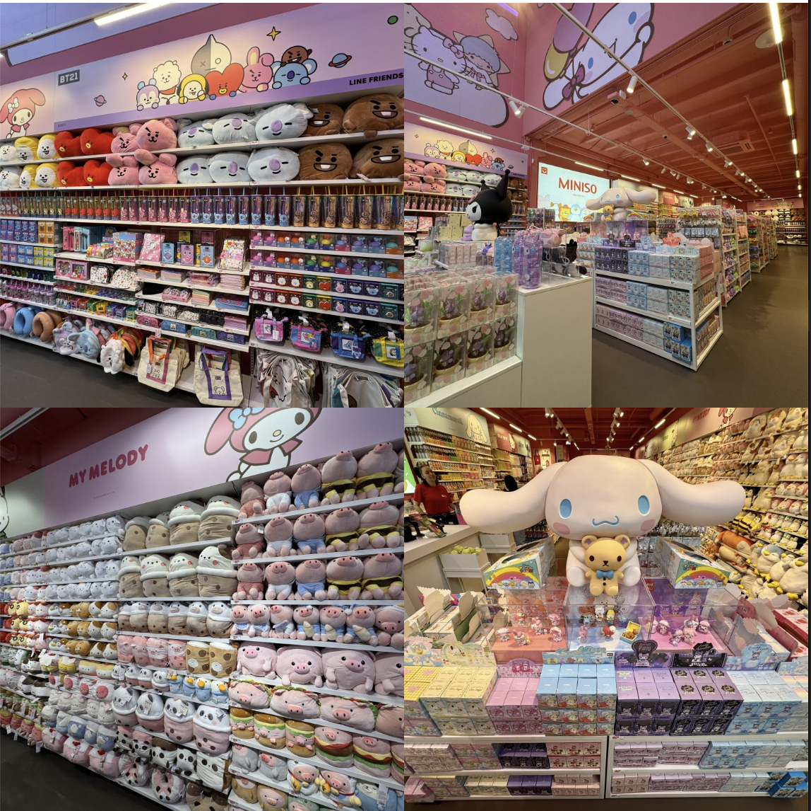
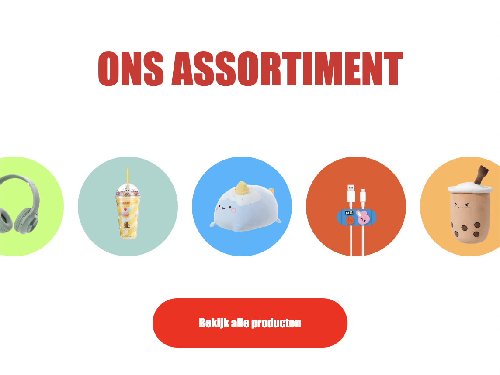

# Procesverslag
Markdown is een simpele manier om HTML te schrijven.  
Markdown cheat cheet: [Hulp bij het schrijven van Markdown](https://github.com/adam-p/markdown-here/wiki/Markdown-Cheatsheet).

Nb. De standaardstructuur en de spartaanse opmaak van de README.md zijn helemaal prima. Het gaat om de inhoud van je procesverslag. Besteedt de tijd voor pracht en praal aan je website.

Nb. Door *open* toe te voegen aan een *details* element kun je deze standaard open zetten. Fijn om dat steeds voor de relevante stuk(ken) te doen.

## Jij

  
uitwerken voor kick-off werkgroep

  ### Auteur:
  Sanne 't Hooft (vervangen door jouw naam)

  #### Je startniveau:
  hier je startniveau (kies uit zwart, rood óf blauw)

  #### Je focus:
  hier je focus (kies uit responsive óf surface plane)
 

## Je website

  
uitwerken voor kick-off werkgroep

  ### Je opdracht:
  link naar de website die je gaat namaken óf de naam/omschrijving van je eigen ontwerp

  #### Screenshot(s) van de eerste pagina (small screen): 
  hier de naam van de pagina  
  

  #### Screenshot(s) van de tweede pagina (small screen):
  hier de naam van de pagina  
  
 

## Toegankelijkheidstest 1/2 (week 1)

  
uitwerken na test in 2e werkgroep

  ### Bevindingen
  Lijst met je bevindingen die in de test naar voren kwamen:

## Breakdownschets (week 1)

  
uitwerken na afloop 3e werkgroep

  ### de hele pagina: 
  

  ### dynamisch deel (bijv menu): 
  

  ### wellicht nog een dynamisch deel (bijv filter): 
  

## Voortgang 1 (week 2)

  
uitwerken voor 1e voortgang

  ### Stand van zaken
  hier dit ging goed & dit was lastig (neem ook screenshots op van delen van je website en code)

  ### Agenda voor meeting
  samen met je groepje opstellen

  | student 1      | student 2          | student 3    | student 4        |
  | Fatima            | Choice                | ---          | ---              |
  | dit bespreken  | en dit             | en ik dit    | en dan ik dat    |
  | en dat ook nog | dit als er tijd is | nog een punt | dit wil ik zeker |
  | hamburger menu animatie            | ...                | ...          | ...              |

  ### Verslag van meeting
  hier na afloop snel de uitkomsten van de meeting vastleggen

  - ipv class, pseudoselectoren
  - geen > tekens

## Voortgang 2 (week 3)

  
uitwerken voor 2e voortgang

  ### Stand van zaken
  hier dit ging goed & dit was lastig (neem ook screenshots op van delen van je website en code)

  ### Agenda voor meeting
  samen met je groepje opstellen

  | student 1      | student 2          | student 3    | student 4        |
  | Fatima          | Zhafira              | ---          | ---              |
  | Form  | en dit             | en ik dit    | en dan ik dat    |
  | Plaatjes | dit als er tijd is | nog een punt | dit wil ik zeker |
  |          | ...                | ...          | ...              |

  ### Verslag van meeting
  hier na afloop snel de uitkomsten van de meeting vastleggen

  - Calc gebruiken
  - Geen GetElementById
- ...

## Toegankelijkheidstest 2/2 (week 4)

  
Geen darkmode, niet screenreader friendly qua headings (ook niet html friendly), menu is niet zo duidelijk voor bijvoorbeeld mensen met gehoorproblemen. e werkgroep

  ### Bevindingen
  De website kan nu in darkmode gebruikt worden. Ik heb headings voor elke sectie/ article, sommigen zijn wel verborgen. Bij mijn menu zie je ook 'menu' staan.

## Voortgang 3 (week 4)

  
uitwerken voor 3e voortgang

  ### Stand van zaken
  hier dit ging goed & dit was lastig (neem ook screenshots op van delen van je website en code)

  ### Agenda voor meeting
  samen met je groepje opstellen

  | student 1      | student 2          | student 3    | student 4        |
  | Fatima         | Zhafira              | ---          | ---              |
  | Responsiveness  | en dit             | en ik dit    | en dan ik dat    |
  | en dat ook nog | dit als er tijd is | nog een punt | dit wil ik zeker |
  | ...            | ...                | ...          | ...              |

  ### Verslag van meeting
  hier na afloop snel de uitkomsten van de meeting vastleggen

  - Mobiel beginnen --> desktop
  - punt 2
  - nog een punt
  - ...

## Eindgesprek (week 5)

  
Over het algemeen ging het namaken van de miniso.nl website best wel stroef, omdat ik eigenlijk weinig voorkennis had en meer had moeten oefenen met de opdrachten. Alhoewel ik in de lessen had geoefend met een paar opdrachten dat dat niet genoeg was voor mij om een heel website na te kunnen maken. Met behulp van mijn docent, de opdrachten, mdn, w3school en chatgpt ben ik vooruit gekomen. Helaas ben ik niet gekomen waar ik wilde komen, maar ik vind dat dit al een grote voortgang is van wat ik hiervoor kon (bijna niks). Dat ik uitendelijk alle errors en infos uit mijzelf kon verbeteren heeft mij laten zien dat ik eigenlijk veel heb geleerd, ondanks dat ik niet volledig tevreden ben geweest over hoe mijn website eraan toe ging. De form en carousel maken was het meest uitdagende totdat ik met javascript en css de filteroptie responsive moest maken. dat is mij helaas niet gelukt, ondanks alle pogingen.

  ### Je uitkomst - karakteristiek screenshots:
  Ik heb geleerd dat ik beter geen placeholder kan gebruiken voor 'date' en hoe ik de form het best responsive kon maken. Ik heb geleerd hoe ik met grid-column-start en end kon werken, maar het eerst beter kon uittekenen op papier.
  

  ### Dit ging goed/Heb ik geleerd: 
  IK heb geleerd hoe ik display: block; kan gebruiken om onnodig witruimte te verwijderen.
  

  ### Dit was lastig/Is niet gelukt:
  Ik heb geleerd hoe ik met javascript de carousel kon laten bewegen en hoe ik met overflow hidden dat balkje kon verbergen.
  

## Bronnenlijst

  
continu bijhouden terwijl je werkt

  Nb. Wees specifiek ('css-tricks' als bron is bijv. niet specifiek genoeg). 
  Nb. ChatGpT en andere AI horen er ook bij.
  Nb. Vermeld de bronnen ook in je code.

  1. chatgpt.com
  2. https://developer.mozilla.org/en-US/docs/Web/CSS/grid-template-columns

